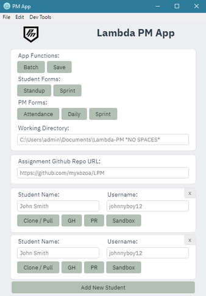

## Lambda PM Companion [](https://travis-ci.com/myxozoa/LPM) [](https://github.com/myxozoa/LPM/releases) [](https://github.com/myxozoa/LPM/releases)




## Download Latest

The latest build is available [here](https://github.com/myxozoa/LPM/releases) for all platforms.

## Basic Usage

- The `Batch` button will `git clone` or `git pull` the input repo from any students added into the `Working Directory` set in `Preferences`.

- The `Save` button will save all the input data to _save_ you from having to input it again on subsequent uses of the app.
- All the links in the sidebar will open a browser window to their respective airtables (right click to copy).

- The `Download` button will perform a `git clone` or `git pull` in the `Working Directory` inside a folder using the student's name depending if the folder exists or not.
- The `Comment` button will open a browser window to the student's PR.
- If there is any unexpected behavior you can check the `Dev Tools` under `Dev Tools > Toggle` to see more information about any errors.

## Building

```
You must have node version >=8 to build this app
```

1. Run `yarn` or `npm i` to install the necessary dependencies. (`yarn` _highly_ recommended)

2. To build an executable run:
   ```
   yarn package
   ```
3. Navigate to the `release` folder to find the folder containing the installer.

4. Install the app like you would any other.

5. Run

```
To build on linux you currently have to install one of the libcurl libraries due to a strange issue causing the nodegit compilation to fail.

I have tested and confirmed libcurl4-openssl-dev to be working, the others may or may not.

To install this on ubuntu you would run sudo apt-get install libcurl4-openssl-dev
```

## To Run for Development

1. Run `yarn` or `npm i` to install the necessary dependencies.

2. Run `yarn start` .

## TODO

- Add popups explaining any errors in addition to the border changes
- Add functionality to allow commenting on a PR directly in the app
- Debounce buttons
- Display whether a student has done a PR
- Add student page to add notes or display data
