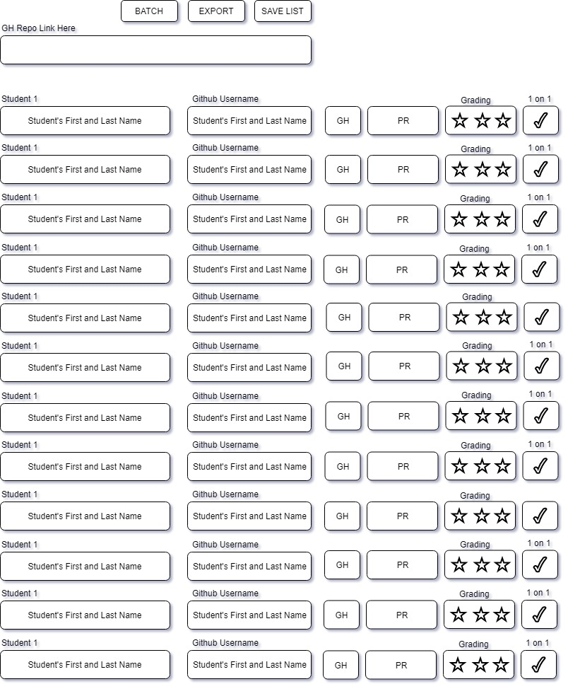

## Lambda PM Companion
1. The purpose of this app is to assist Lambda School Project Managers with daily tasks, to eliminate repetition of work and streamline daily tasks.

## Whiteboard of the PM Code Review GUI

## Expected Functionality and Flow of User Interaction
1. The user would enter the github link to a Lambda School Repository in the `GH Repo Link Here` text box.
2. The very first time a user interacts with the application, he/she will have to enter the first and last name of the student, and the student's github username.
3. At this point the user should press the `SAVE LIST` button on the top right corner of the screen, which will prompt the application to do the following:
  * Create a DB document for that specific School Repository that will contain all the information.
  * Create a DB document for the list of students, to automatically load them in the future.
  * Populate both documents.
4. From here the application would utilize the provided information to do the following:
  * Create a Folder named: [FirstName LastName] for each student listed.
  * Place a shortcut inside that folder to the student's github profile landing on the list of all repositories.
  * Clone the respective fork for the provided Repo inside the respective student's folders.
  * Generate links for both Github Repo, and Pull Request related to that specific project.
  * Save all the information to the DB document.
5. If the `EXPORT` button is pressed then a snapshot of all the information currently in the database pertaining to that specific project will be exported to a JSON file.
6. If the `BATCH` button is pressed, a BASH script to perform the Folder Creations, and GitHub Cloning of each of the student's repositories will be executed.
7. Information like Grading Stars and 1 on 1 CheckMarks will also be stored in the database once filled in.
