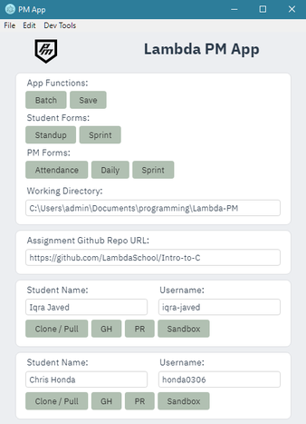

## Lambda PM Companion
1. The purpose of this app is to assist Lambda School Project Managers with daily tasks, to eliminate repetition of work and streamline daily tasks.



## Requirements
* `git` installed and configured
* `node.js` with `npm` or `yarn` installed and configured

## Basic Usage
* The `Batch` button will `git clone` or `git pull` the input repo from any students added into the `Working Directory`.
    ```
    Note: The Working Directory must be an absolute path.
    ```
* The `Save` button will save all the input data to _save_ you from having to input it again on subsequent uses of the app.
* All the `Forms` buttons will open a browser window to their respective airtables.
* The `Clone \ Pull` button will perform a `git clone` or `git pull` in the `Working Directory` inside a folder using the student's name depending if the folder exists or not.
* The `GH` button will open a browser window to the student's github in the repository section.
* The `PR` button will open a browser window to the student's PR on the input repo.
* The `Sandbox` button will open a Code Sandbox with the student's git repo (intended for React etc. repos, may not work for others).
* If there is any unexpected behavior you can check the `Dev Tools` under `Dev Tools > Toggle` to see more information about any errors.

## Building
1. Run `yarn` or `npm i` to install the necessary dependencies.

2. To build an executable run:
    ```
    npm run package-win
    or
    npm run package-mac
    or
    npm run pacakge-linux
    ```
    depending on your target platform.

3. Navigate to the `release-builds` folder to find the folder containing the executable.

## To Run for Development
1. Run `yarn` or `npm i` to install the necessary dependencies.

2. Run `npm start` .

## TODO
* Add popups explaining any errors in addition to the border changes
* Add functionality to allow commenting on a PR directly in the app